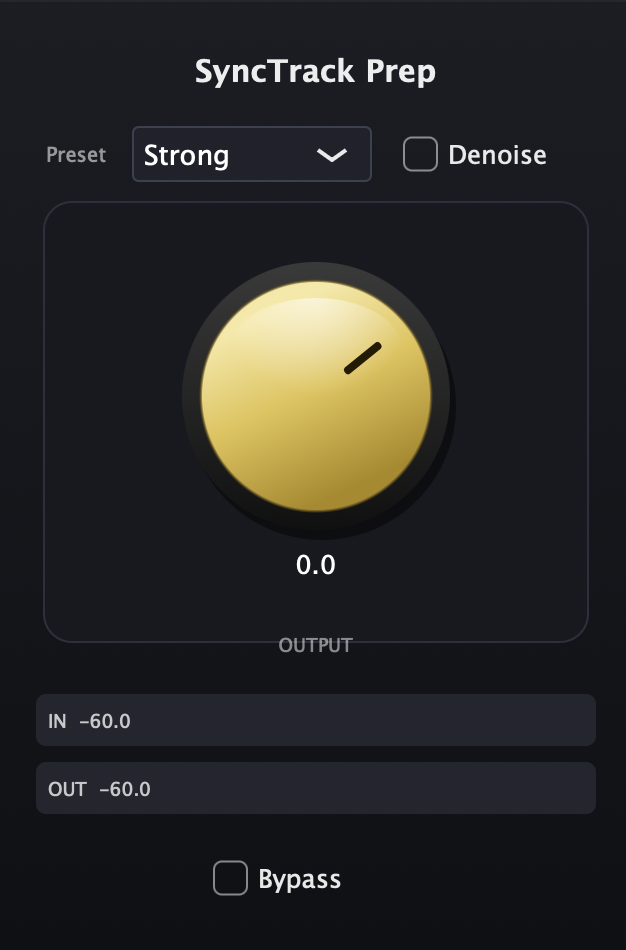

# SyncTrack Prep

**English** | [简体中文](README.zh-CN.md)

A real-time **VST3** insert effect for production (sync) audio tracks. It repairs broken channel layouts, tames the noise floor, levels dialogue, and enforces a true-peak ceiling — so location dialogue stays intelligible underneath a music bed.

<p align="center">
  
</p>

---

## What it does

When you import production audio from a camera or field recorder into a video-post session, you usually hit the same problems: the file is a mono source parked on one channel, the noise floor drifts, dialogue level jumps between takes, and peaks clip once you add music. SyncTrack Prep is a single insert that handles that first-pass cleanup so the sync track is usable as a reference or as a rough mix.

### Signal chain

```
In → ChannelRepair → Leveler → HPF → NoiseSuppressor → OutputGain → PeakCompressor → TruePeakLimiter → Out
```

* **Fixed latency: 575 samples** (denoise STFT 511 + limiter look-ahead 64). Reported once at `prepareToPlay`; toggling **Denoise** does *not* change it, so the host's delay compensation stays valid.
* The leveler sits *before* the denoiser on purpose: the spectral stage can then shave the floor the leveler has just lifted (this is what the **Clean** preset relies on).
* **Output is the chain's makeup gain**, placed *ahead* of the always-on safety stages. The −1 dBTP ceiling therefore holds at *any* knob position: turning Output up lifts quiet content until it meets the ceiling, and anything that would exceed it is clamped by the compressor and limiter. At 0 dB the chain behaves as if the knob were not there.

### Concepts

| Term | Meaning |
|---|---|
| **Production track** | Imported video production audio: dialogue mixed with location SFX. |
| **Channel repair** | Corrects a bad channel layout and long-term L/R energy imbalance. |
| **L-only / R-only** | One channel is below the activity threshold while the other has content — treated as mono parked on one side. |
| **Leveler** | Slow automatic gain that pulls active content toward a target loudness zone (−18 dB). |
| **Peak control** | Faster downward dynamics that tames peaks and bangs. |
| **True-peak ceiling** | Maximum allowed true-peak level (−1 dBTP). |
| **Noise profile** | Estimate of the stationary noise spectrum, learned from low-energy gaps. |
| **Dialogue intelligibility** | Whether production speech is understandable under a music bed. This is the product's success criterion — *not* broadcast LUFS compliance. |

---

## Download & install

Grab the archive for your platform from the [Releases](../../releases) page.

### macOS (Universal 2 — Apple Silicon + Intel)

1. Unzip `SyncTrack-Prep-<version>-macOS-Universal.zip`.
2. Move `SyncTrack Prep.vst3` into either:
   * `~/Library/Audio/Plug-Ins/VST3/` — current user only, no admin password, **recommended**
   * `/Library/Audio/Plug-Ins/VST3/` — all users, needs an admin password
3. **Clear the quarantine flag.** The build is not notarized by Apple, so macOS will refuse to load it straight out of a downloaded zip. In Terminal:

   ```bash
   xattr -dr com.apple.quarantine ~/Library/Audio/Plug-Ins/VST3/"SyncTrack Prep.vst3"
   ```

   If your DAW still won't load it, open **System Settings → Privacy & Security**, scroll to the bottom, and click **Open Anyway** next to the blocked item.
4. Fully quit and relaunch your DAW, then rescan VST3 plug-ins.

### Windows (x64)

1. Unzip `SyncTrack-Prep-<version>-Windows-x64.zip`.
2. Move `SyncTrack Prep.vst3` into `C:\Program Files\Common Files\VST3\` (you will need administrator rights).
3. Restart your DAW and rescan VST3 plug-ins.

> The Windows binary is produced by CI but has **not** been verified inside a DAW yet — see [Known limitations](#known-limitations).

---

## Host support

| DAW | Status |
|---|---|
| **Cubase** | ✅ Verified — runs stably in real time and in offline bounce (tested on macOS) |
| **Nuendo** | ✅ Verified — runs stably in real time and in offline bounce (tested on macOS) |
| Reaper | ⚠️ Not verified |
| FL Studio | ⚠️ Not verified |
| Studio One | ⚠️ Not verified |
| Pro Tools | ❌ Not supported — needs AAX, which is not built yet |
| Logic Pro | ❌ Not supported — needs AU, which is not built yet |

Only the **VST3** format is built today. AAX and AU are on the roadmap.

### If a bounce sounds unprocessed

If offline metrics look right but the exported file is dry, the plug-in is almost certainly not in the render path. Check, in order:

1. The insert is **enabled** (power button lit) on the **same track** you are exporting.
2. A **Soft** export and a **Strong** export are *not* bit-identical.
3. The plug-in's IN/OUT meters move during playback.
4. The insert is on a **stereo** track, not a multi-mono slot.
5. After rebuilding the plug-in: fully quit the DAW, rescan VST3, and re-insert the plug-in.

---

## Using it

There are four controls, and that is deliberate — the presets carry the tuning.

| Control | Range | Notes |
|---|---|---|
| **Preset** | Soft / Strong / Clean | Default **Strong**. Switching preset also sets the Denoise default (on for Clean, off for Soft/Strong); your own Denoise choice is kept until you switch preset again. |
| **Denoise** | on / off | Spectral noise suppression. Latency is unchanged either way. |
| **Output** | −24 … +12 dB | Makeup gain ahead of the safety stages. The −1 dBTP ceiling always holds. |
| **Bypass** | on / off | True bypass — the input is passed through untouched. |

**Which preset?**

* **Soft** — light touch. Use when the source is already fairly clean and you only want layout repair plus gentle levelling.
* **Strong** *(default)* — the workhorse. Heavier levelling (up to +18 dB of gain, 3:1 peak control) for takes with wide level swings.
* **Clean** — the leveler backs off and the denoiser does the work (Denoise defaults to on). Use when a steady noise floor is the main problem.

All three presets share the same targets: leveler target −18 dB, high-pass at 70 Hz, true-peak ceiling −1 dBTP, peak compressor always on.

Only stereo in / stereo out is supported.

---

## Known limitations

Being upfront about these will save you an issue report.

* **Steady-noise reduction can be undramatic on real material.** Because the leveler runs *before* the denoiser, quiet sections get their noise floor lifted first (on our reference material, by roughly 9 dB) and the denoiser then has to claw that back. On our test source the measured noise-floor level of the **Clean** output ended up *above* the source rather than below it. This is a chain-ordering trade-off, not a bug in the spectral stage: the same denoiser pulls a synthetic steady floor down by more than 4 dB in the unit tests. Use the offline render tool below to A/B on your own material before deciding.
* **The noise estimator needs about a second to settle.** It learns the noise spectrum mid-stream, so if a clip opens on speech the first ~16 STFT frames can briefly learn dialogue instead of noise. It self-corrects in roughly one second.
* **Windows binaries are unverified.** They are compiled and unit-tested by CI, but nobody has loaded them into a Windows DAW yet.
* **Stereo only.** No surround or multi-channel support.
* **Not a delivery tool.** SyncTrack Prep does not do broadcast loudness delivery (EBU R128 masters), AI dialogue/music separation, or offline spectral repair and de-clipping. It is a first-pass cleanup insert for sync tracks.

---

## Build from source

Requirements: a C++17 compiler, **CMake ≥ 3.21**, and network access on the first configure (JUCE 8.0.8 and Catch2 3.4.0 are fetched automatically).

```bash
git clone <this repo>
cd "SyncTrack Prep"
cmake -B build -DCMAKE_BUILD_TYPE=Release
cmake --build build -j 8
ctest --test-dir build --output-on-failure
```

On macOS this produces a Universal 2 (arm64 + x86_64) binary. `COPY_PLUGIN_AFTER_BUILD` is on, so the VST3 is copied into your user plug-in folder as part of the build.

Already have JUCE or Catch2 checked out? Point CMake at them to skip the download:

```bash
cmake -B build -DSTP_JUCE_PATH=/path/to/JUCE -DSTP_CATCH2_PATH=/path/to/Catch2
```

Build targets:

| Target | What it is |
|---|---|
| `SyncTrackPrep` | The VST3 plug-in (plus a Standalone app for quick auditioning) |
| `SyncTrackPrepOffline` | CLI renderer — process a WAV without a DAW |
| `SyncTrackPrepTests` | Catch2 DSP unit tests |
| `SyncTrackPrepStateTests` | Catch2 processor/APVTS state tests |

Pass `-DSTP_BUILD_TESTS=OFF` to skip the test targets.

---

## Offline rendering and A/B analysis

The offline renderer runs the exact same DSP chain as the plug-in, so you can prove out the processing — and compare presets — with no DAW involved.

```bash
cmake --build build -j 8 --target SyncTrackPrepOffline
./build/SyncTrackPrepOffline input.wav output-strong.wav strong 1
```

Arguments: `<in.wav> <out.wav> [soft|strong|clean] [denoise 0|1]`

Three analysis helpers live in `scripts/` (Python 3; `analyze_ab.py` and `diagnose_stereo_noise.py` need `ffmpeg` on your `PATH`):

```bash
# Full A/B report: loudness gap, steady-noise level, true peak
python3 scripts/analyze_ab.py --gold input.wav --proc output-strong.wav --run-id my-run

# Why did the leveler's noise gate open or close here?
python3 scripts/diagnose_gate.py input.wav --noise-window 30:40 --dialogue-window 0:14

# Is the noise actually stereo, or is it one channel leaking?
python3 scripts/diagnose_stereo_noise.py --gold input.wav
```

`analyze_ab.py` writes a per-second CSV, a one-row aggregate CSV with pass/fail flags, and a readable Markdown report.

---

## Roadmap

* Verify Windows builds inside Cubase / Nuendo on Windows
* AAX (Pro Tools) and AU (Logic Pro) builds
* Revisit the leveler-before-denoiser ordering so steady-noise reduction is measurable on real material
* Validate against Reaper, FL Studio and Studio One

---

## License

SyncTrack Prep is released under the **GNU Affero General Public License v3.0 or later** (AGPL-3.0-or-later). See [LICENSE](LICENSE) for the full text.

Why AGPL: this plug-in links the [JUCE](https://juce.com) framework, whose modules are dual-licensed under AGPLv3 or a commercial JUCE licence. Distributing it under AGPLv3 is the licence-compatible way to ship it as free software. If you fork it and distribute a binary, you must publish your source under the same terms.

Third-party components:

* **JUCE 8.0.8** — AGPLv3 or commercial JUCE licence. Fetched at configure time; not vendored here.
* **Steinberg VST3 SDK** — bundled inside JUCE, dual-licensed proprietary or GPLv3.
* **Catch2 3.4.0** — Boost Software License 1.0. Test-only dependency, fetched at configure time.

VST is a trademark of Steinberg Media Technologies GmbH, registered in Europe and other countries.
